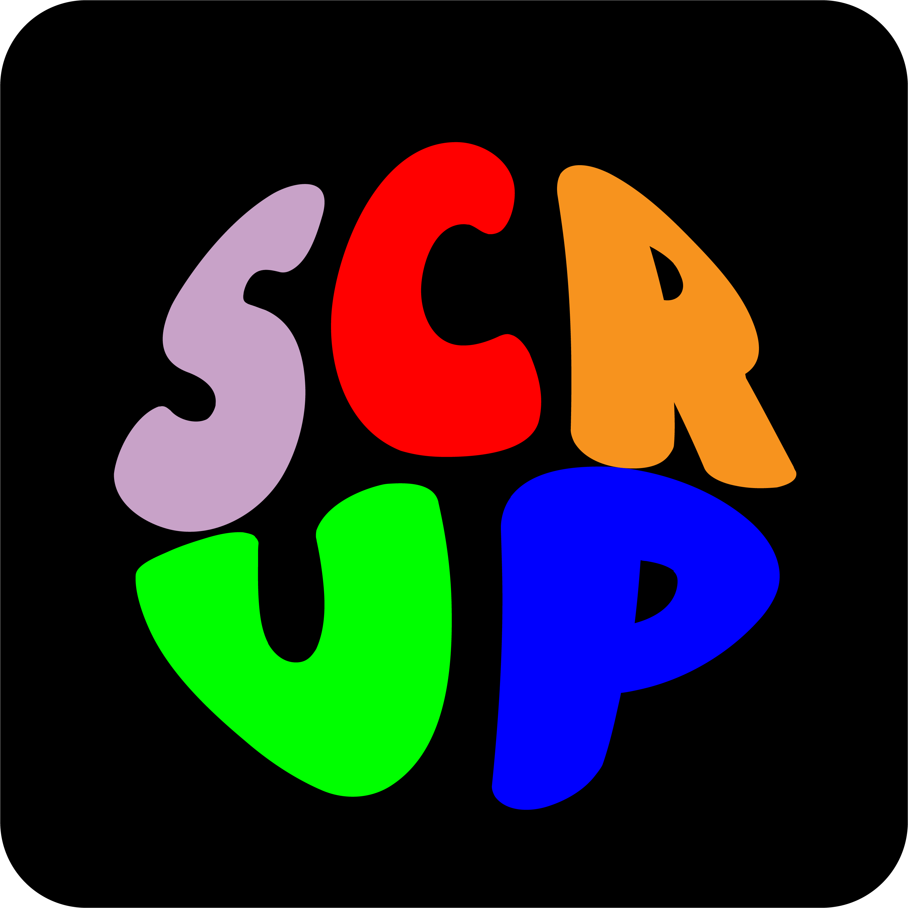

<p align="center">
  
</p>

# Scrup

Scrup is a music player for YouTube that downloads tracks with `yt-dlp` and plays them from a local file using `media-kit` (the mpv engine). The first time a song plays, audio starts as soon as the partial download has data, while the download finishes in the background and is cached to disk. Later plays are served from the local cache, which avoids the dropouts of YouTube remote streams.

Metadata, history and playlists are stored in a local SQLite database using `drift`.

Target platforms: Windows, Linux and macOS with a single Flutter codebase.

## What it includes

### Playback
- Progressive playback: a song starts with the first bytes of the partial file and the download keeps running in the background until it is cached. Later plays are instant from disk.
- Queue: play playlists or individual songs with auto-advance. Reorder tracks by drag and drop, like playlists. Queue order, current index and active playlist persist between sessions.
- Shuffle, repeat and radio mode: shuffle keeps the original order and randomizes playback, repeat has off/all/one modes, and radio mode auto-recommends the same artist or genre when the queue runs out. Radio mode is on by default.
- Audio output device selector: a dropdown next to the volume icon switches between speakers, headphones, HDMI and other devices. It works on Windows with WASAPI, Linux with PulseAudio, PipeWire or ALSA, and macOS with CoreAudio.
- Silence skip: automatically skips silent gaps in songs.
- Local audio cache: LRU eviction by size, configurable from 512 MB to unlimited in Settings. Downloads show progress and are deduplicated. Later plays are instant from disk.

### Search and import
- Search: search songs and play them instantly. It combines YouTube Music for clean canonical metadata with general YouTube through `yt-dlp`. YouTube Music results come first, then loose videos. Duplicates are removed and the app degrades gracefully if YouTube Music fails.
- Playlist import: paste a link and Scrup creates a local playlist automatically, with a live matching dialog for each track:
  - Spotify: reads public playlists without API keys from the web embed and matches each track against YouTube by title, duration and artist.
  - YouTube and YouTube Music: complete read through the InnerTube browse API with pagination and exact matching.
- Search inside playlists: filter tracks inside any playlist.

### Lyrics
- Synced lyrics: auto-scroll with a word-by-word karaoke mode, loaded from more than one provider with automatic fallback.
- Provider selector: choose which lyrics API to search, or leave it on auto.
- Tap to seek: tap any line to jump to that position.
- Manual search and sync: search lyrics manually, adjust the timing offset, or paste raw LRC text.

### UI and experience
- Dynamic theme: the accent color adapts to the artwork of the playing track. The accent can also be recalculated manually from the track context menu or Settings.
- Fullscreen mode: an immersive view with animated background, large artwork and lyrics.
- Custom title bar: on all three platforms. Windows and Linux are frameless, and macOS keeps the native traffic lights.
- Queue panel: a slide-in list from the right side with drag and drop reorder. Its open or closed state is restored between sessions.
- Pointer cursor: buttons, dropdowns, context menus and interactive elements show a hand cursor on hover.
- Context menus: right-click any track on the home screen, playlist or player for quick actions such as play, add to playlist, edit metadata and recalculate colors.
- Metadata enrichment: on playback, tracks are enriched through YouTube Music's internal API for a clean title, artist, album and thumbnail without an API key. Metadata can also be edited manually and searched across Deezer, Apple Music, YouTube Music and Spotify oEmbed.
- Favorites: a special playlist that cannot be deleted, with quick access from the heart button in the player.

### Discord
- Rich Presence: publishes the playing song, including title, artist, album, cover and timer, through Discord's local IPC without native libraries. It uses only Dart and OS FFI.
- Dynamic title: the Discord header shows the song title instead of the app name.
- Pause support: the progress bar and timer freeze when paused and resume when playing.
- Small icon: an optional app icon can appear in the presence thumbnail. It is configured in the Discord Developer Portal.

## Requirements

- Flutter SDK stable with desktop support for Windows, Linux or macOS.
- On Windows: Visual Studio Build Tools with the Desktop development with C++ workload, which includes the Windows SDK.

## Getting started

```bash
# 1. Optionally download sidecar binaries for your platform
#    (yt-dlp + ffmpeg + deno). If skipped, the app downloads them itself
#    on first start.
bash tool/fetch_binaries.sh

# 2. Generate drift code after changing tables
dart run build_runner build

# 3. Generate the version from pubspec.yaml
dart run tool/gen_version.dart

# 4. Run in development
flutter run -d windows   # or -d linux / -d macos

# 5. Build
flutter build windows    # or build linux / build macos
```

Sidecar binaries are stored in a `tools/` subfolder next to the executable in the build, or resolved from `bin/<platform>/` during development. You can override their paths with the environment variables `SCRUP_YTDLP_PATH`, `SCRUP_FFMPEG_PATH` and `SCRUP_DENO_PATH`.

deno is optional but recommended. `fetch_binaries.sh` also downloads yt-dlp's JS runtime. yt-dlp 2026 and later deprecated YouTube extraction without a JS runtime, so extraction can be incomplete without it. With deno in the subprocess PATH, extraction stays complete. If the deno download fails, the app still works with degraded extraction, and an already-installed system deno is also detected.

## File structure

```
lib/
├── core/              # Binaries, Track, lyrics and utilities
│   ├── binaries.dart              # Sidecar resolution and auto-download
│   ├── track.dart                 # Track model
│   ├── title_cleaner.dart         # YouTube title cleanup
│   ├── queue_shuffle.dart         # Queue shuffling
│   ├── synced_lyrics.dart         # Synced lyrics model (LRC)
│   ├── lyrics_search_result.dart  # LRCLIB result DTO
│   └── version.g.dart            # Generated version from pubspec.yaml
├── data/              # Drift: tables, DB, history, playlists and favorites
├── l10n/              # Language ARBs (es, en, pt, pt_BR, ru, ja, ko, zh)
│   └── generated/     # Generated AppLocalizations
├── services/
│   ├── ytdlp_service.dart             # yt-dlp subprocesses (search/download)
│   ├── ytmusic_service.dart           # YouTube Music via InnerTube
│   ├── search_service.dart            # YT Music + yt-dlp merge with dedupe
│   ├── spotify_import_service.dart    # Spotify playlist reading (embed)
│   ├── audio_cache_service.dart       # Local cache with LRU and preload
│   ├── player_service.dart            # Queue, repeat, shuffle, radio, audio devices
│   ├── deezer_service.dart            # Deezer API for metadata enrichment
│   ├── metadata_lookup_service.dart   # Multi-source metadata search
│   ├── lyrics_service.dart            # Synced lyrics (LRCLIB, KPoe)
│   ├── scrup_audio_handler.dart       # SMTC / Now Playing / MPRIS
│   ├── artwork_palette_service.dart   # Artwork color extraction
│   ├── palette_cache_store.dart       # Artwork color cache on disk
│   ├── artwork_cache_service.dart     # Artwork image cache
│   ├── playlist_cover_store.dart      # User-chosen cover copying
│   ├── settings_store.dart            # Persisted session preferences
│   ├── silence_skip_service.dart      # Auto-skip silent gaps
│   └── discord/                       # Rich Presence (IPC + FFI)
├── ui/
│   ├── app_shell.dart         # Title bar + navigation + keyboard shortcuts + mouse buttons
│   ├── playback.dart          # playTrack / playQueue helpers
│   ├── locale_controller.dart # Hot language switching
│   ├── theme_controller.dart  # Dynamic accent from artwork
│   ├── playlist_actions.dart  # "Add to playlist" modal
│   ├── views/                 # Home, Search, PlaylistDetail, Lyrics, Settings
│   └── widgets/               # CustomTitleBar, PlayerBar, TrackTile, QueuePanel,
│                               # PlaylistsSidebar, LyricsDisplay, CoverImage,
│                               # ContextMenuItem, SpotifyImportDialog
└── tool/
    ├── fetch_binaries.sh      # Downloads yt-dlp + ffmpeg + deno per OS
    ├── gen_version.dart       # Generates version.g.dart from pubspec.yaml
    └── gen_logo.dart          # Logo generation utility
```

## Validation commands

```bash
flutter analyze
flutter test
```

## If you move the project folder

CMake caches absolute paths. After moving the project elsewhere, or undoing a duplicated folder, clear the caches before rebuilding:

```bash
rm -rf build .dart_tool
flutter pub get
dart run build_runner build
dart run tool/gen_version.dart
flutter build windows
```

Then copy the sidecar binaries next to the executable again, or run `tool/fetch_binaries.sh` from the build folder.
